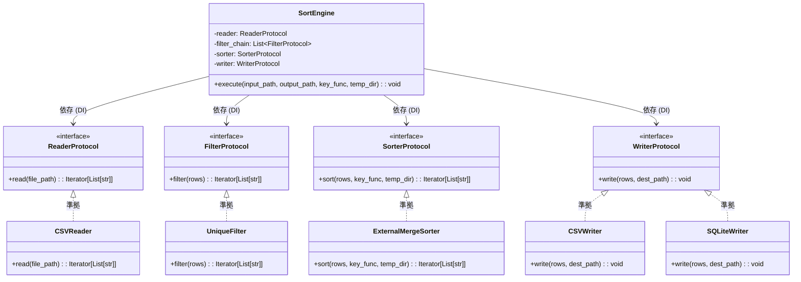

# sort_engine アーキテクチャ設計書 (疎結合設計)

本ドキュメントでは、`sort_engine` モジュールで採用されている疎結合設計と、各コンポーネントの関係性について解説します。

---

## 🏗️ アーキテクチャ概要

本システムは、ファイルI/O、フィルタリング、ソート、書き出しといった各責務を完全に分離し、プロトコル（インターフェース）を介してやり取りを行うパイプライン・アーキテクチャを採用しています。
コアエンジンである `SortEngine` は特定の具象クラスに依存せず、インターフェースに対して依存（Dependency Injection）します。

### クラス・関係ダイアグラム

---

## 🧱 主要コンポーネントの役割

### 1. `SortEngine` ([src/sort_engine/engine.py](file:///c:/Users/xzyoi/Desktop/python/pliant-data-stream/src/sort_engine/engine.py))
パイプライン処理の実行制御を行うコアエンジンです。
- **依存関係注入 (DI)**: 初期化時に各プロトコル（`Reader`, `Filter`, `Sorter`, `Writer`）を実装したインスタンスを受け取ります。
- **ストリーム実行**: データをジェネレータ（ストリーム）で流し、メモリ消費量を抑えながら「読み込み ➔ フィルタリング ➔ ソート ➔ 書き出し」のパイプラインを実行します。

### 2. インターフェース定義 ([src/sort_engine/interface.py](file:///c:/Users/xzyoi/Desktop/python/pliant-data-stream/src/sort_engine/interface.py))
`typing.Protocol` を用いて、各層が満たすべき共通のインターフェースを定義しています。

* **`ReaderProtocol`**: ファイルを読み込み、パースして行データ（リスト）のストリームを返します。
* **`FilterProtocol`**: ストリームを受け取り、加工や除外を行って新たなストリームを返します。
* **`SorterProtocol`**: ストリームを受け取り、ソートされたストリームを返します。
* **`WriterProtocol`**: 最終ストリームを指定の宛先に書き出します。

### 3. 具象実装クラス

* **`CSVReader`** ([src/sort_engine/reader.py](file:///c:/Users/xzyoi/Desktop/python/pliant-data-stream/src/sort_engine/reader.py))
  - `ReaderProtocol` に準拠。デリミタ自動判定（将来実装）および行パースを担当します。
* **`UniqueFilter`** ([src/sort_engine/filter.py](file:///c:/Users/xzyoi/Desktop/python/pliant-data-stream/src/sort_engine/filter.py))
  - `FilterProtocol` に準拠。指定されたキーカラム群に基づいて重複データを排除します。
* **`ExternalMergeSorter`** ([src/sort_engine/sorter.py](file:///c:/Users/xzyoi/Desktop/python/pliant-data-stream/src/sort_engine/sorter.py))
  - `SorterProtocol` に準拠。一時ファイル書き出しとマージを組み合わせる外部マージソートを担当します。
* **`CSVWriter` / `SQLiteWriter`** ([src/sort_engine/writer.py](file:///c:/Users/xzyoi/Desktop/python/pliant-data-stream/src/sort_engine/writer.py))
  - `WriterProtocol` に準拠。CSV出力、またはSQLiteデータベースへのインポート・永続化を担当します。

---

## 🌟 疎結合設計のメリット

1. **拡張容易性 (Open/Closed Principle)**
   たとえば、JSON形式の入力や、フィルタ条件の追加（カスタムフィルタ）を行う際、`SortEngine` の内部ロジックを修正する必要はありません。プロトコルに準拠したパーサやフィルタクラスを新規作成し、エンジン起動時に注入するだけで拡張可能です。

2. **テスト容易性 (Testability)**
   `SortEngine` 単体の結合テストにおいて、実際のファイルシステムや重いソート処理に依存せず、モッククラス（`MockReader`, `MockSorter` 等）を用いて高速かつ信頼性の高いテストを記述できます。
   （※ `tests/test_sort_engine.py` でこのモックテストが実行されています）
